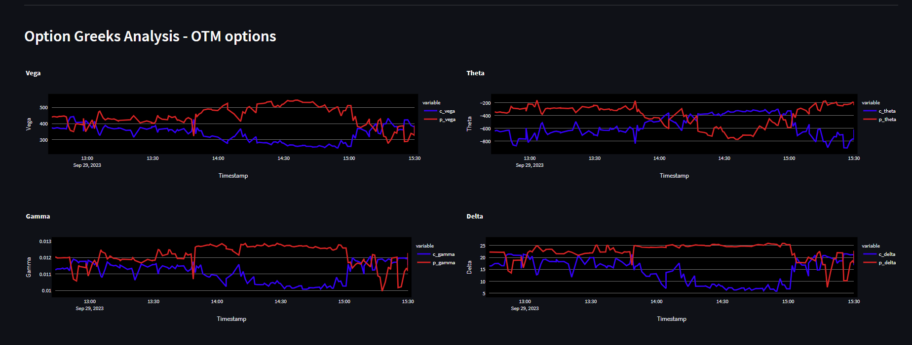
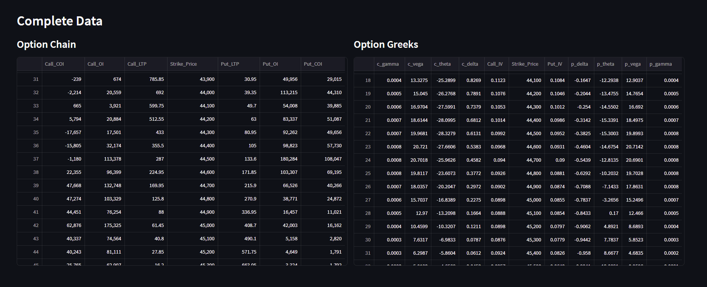

# Quant_Project_5
 

 "## Code"

"For detail code refer my github repo :- "
" 1. [[webApp]](https://quantproject1-csovwwndasw9kuk2vpygjp.streamlit.app/) [Predictive Analysis of Stock Trajectories using Geometric Brownian Motion](https://github.com/Kapil3003/Quant_Project_1/blob/main/Project_1_GBM.ipynb)"

" 2. [Comprehensive VaR Analysis: Methods Comparison, Backtesting, and Stress Testing](https://github.com/Kapil3003/Quant_Project_2/blob/main/Project_2_VaR_Analysis.ipynb)"

" 3. [Robust Trading Strategy Development using Walk Forward Optimization](https://github.com/Kapil3003/Quant_Project_3/blob/main/Project_3_StrategyDevelopment.ipynb)"

" 4. [Market Volatility Forecasting: An ExtensiveComparative Study](https://github.com/Kapil3003/Quant_Project_4/blob/main/Project_4_Volatility%20Forecasting.ipynb)"

" 5. [[webApp]](https://quantproject5-gcs2rtyqub8wj8osxwegu2.streamlit.app/) [Real-Time Options Chain Data Analysis Dashboard](https://github.com/Kapil3003/Quant_Project_5)"

